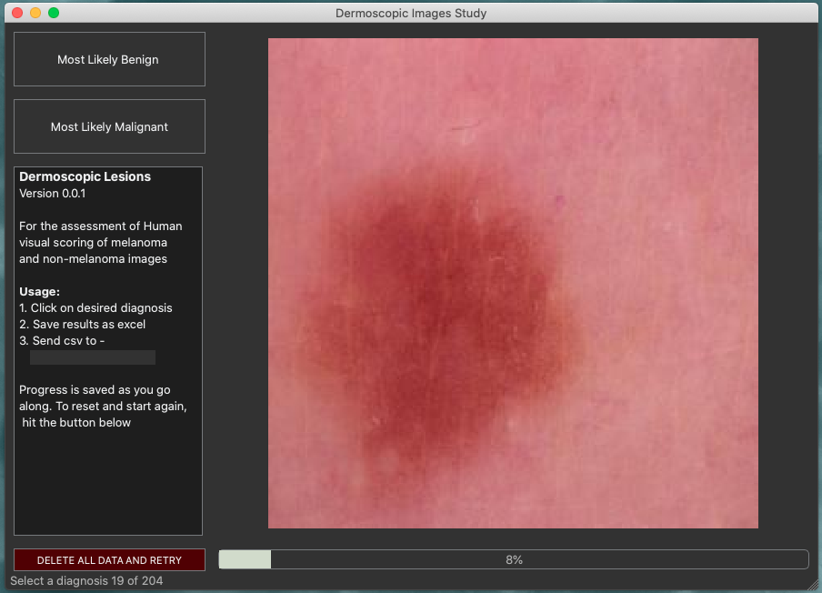

# Dermoscopic Scoring Application

For the marking of images by clinicians to determine whether they are affected by adversarial changes.

## To run - 
- download the whole repo as a zip file
- unzip
- run either the Windows10 version or the Mac Version

This was only tested on MacOS Caltalina and Windows10 but may still work on older systems.

## The user interface - 
- on the left there are two options to choose from
- select the diagnosis that you believe the image corresponds to
- when you complete all images, you will be prompted to save results as a csv file
- please send the results back to the study coordinator
- it is not possible to exit without saving results
- if you quit the application during the test the results will not be recorded

  
Fig 1. example of the user interface on Mac